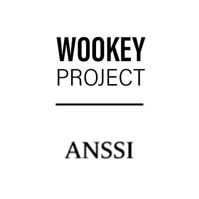

.. Wookey documentation master file, created by
   sphinx-quickstart on Thu Mar 22 10:31:37 2018.
   You can adapt this file completely to your liking, but it should at least
   contain the root `toctree` directive.

Welcome to the WooKey project documentation!
============================================

The USB bus has been a growing subject of research in recent years.
More specifically, securing the USB stack (and hence the USB hosts and devices)
started to draw interest from the academic community since major and massively
exploitable flaws have been revealed with the BadUSB threat [nohl2014badusb]_.

The work presented in this project takes place in the design initiatives that have emerged to thwart
such attacks. While some proposals have focused on the host side by enhancing the
Operating System's USB sub-module robustness or adding a proxy between the host and
the device, we have chosen to focus our efforts on the device side. More specifically, our work
presents the Wookey platform: a custom STM32 based USB thumb drive with mass storage capabilities
designed for user data encryption and protection, with a full-fledged set of in-depth security defenses.

The device embeds a firmware with a secure DFU (Device Firmware Update) implementation using up-to-date cryptography as well
as an external and extractable authentication token embedding a secure element. The runtime software
security is built upon **EwoK**: a custom microkernel implementation designed
with advanced security paradigms in mind, such as memory confinement using the MPU (Memory Protection Unit) and
the integration of safe languages and formal methods for very sensitive modules.

This microkernel comes along with **Tataouine**: a versatile and modular SDK that has been developed to easily integrate
user applications in C, Ada and Rust. Another strength of this project is its core guiding
principle: provide an open source and open hardware platform using off-the-shelf components
for the PCB design to ease its manufacturing and reproducibility.

.. toctree::
   :caption: Table of Contents
   :name: mastertoc
   :maxdepth: 2

   Quickstart <quickstart>
   Target of the project <target>
   About Security concerns <security>
   EwoK microkernel <ewok>
   EwoK standard library <std>
   Tataouine SDK <tataouine>
   Basic applications <basicapps>
   Publications <publi>

.. Indices and tables
   ==================

.. * :ref:`genindex`
   * :ref:`modindex`
   * :ref:`search`

.. rubric:: References

.. [nohl2014badusb] BadUSB-On accessories that turn evil, Karsten Nohl and Jakob Lell, Black Hat USA, 2014

