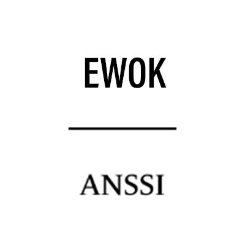

EwoK Standard library
=====================

.. contents::

Introduction
------------

EwoK standard library is the EwoK microkernel userspace library hosting:

   * The userspace syscall part
   * The various embedded-specific utility functions (such as registers manipulation helpers)
   * Some various basic functions for string manipulation, etc.

libstd API
----------

The libstd API is decomposed in various and small foot-print specific components.

.. image:: img/std_arch.png
   :alt: libstd architecture
   :align: center

Each component is described bellow.

.. toctree::
  EwoK libstd's libstring <std/libstring>
  EwoK libstd's libembed <std/libembed>
  EwoK libstd's libstream <std/libstream>
  EwoK libstd API FAQ <std/faq>

.. TODO: for future delivery: EwoK libstd's liballoc <std/liballoc>
