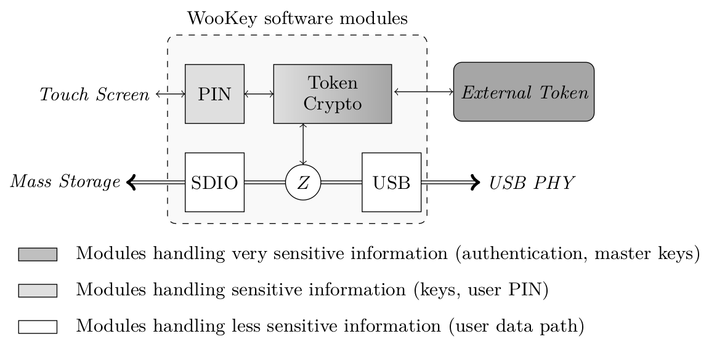
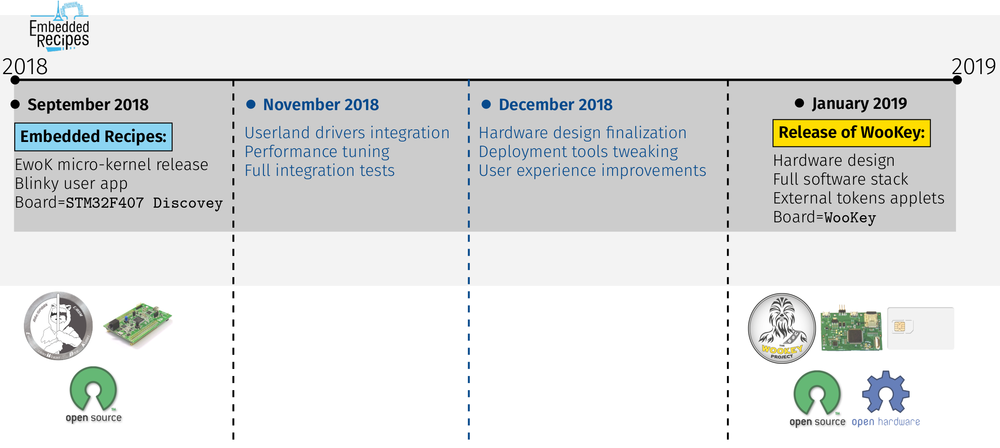

.. _targetofproject:

The WooKey project
=====================

.. contents::

Context
-------
USB devices are nowadays ubiquitous and participate to a wide variety
of use cases. Recent studies have exposed vulnerabilities on the USB implementations,
and among them the BadUSB attacks are a serious threat against the integrity of USB devices.
Firmwares, hosts Operating Systems, as well as user data confidentiality are at risk.
As a matter of fact, this can have critical consequences knowing that USB mass storage devices are used to transfer
public or confidential data between different machines, including in air gaped networks.

Some proprietary devices are already sold as preventive solutions against the BadUSB class of attacks.
They however lack code or architecture/design review, sometimes yielding in crucial defects.
The academic community has, for its part, focused on the host side by enhancing the Operating
Systems USB sub-module robustness
and by developing filtering proxies. Such approaches,
albeit interesting, can be non-portable and do not protect the USB device itself when it is
lost or falls in the hands of adversaries.

Such limitations inclined us to prototype a secure and trustworthy USB mass storage device.
This documentation compiles the results of this initiative, and provides insight into how we
designed and implemented WooKey using off-the-shelf components under open source and open hardware constraints.

Target usage of WooKey
----------------------

When compiling all the desirable security features that one wants for a
secure USB device, no open source solution seems to offer a comprehensive
answer. Proprietary solutions being out of scope since no architecture and
code review are possible, the WooKey project has emerged. It aims at
prototyping a secure and trusted USB mass storage device featuring user
data encryption and strong user authentication, with fully open source and
open hardware foundations.

We outline the fact that even though the prototype focuses on the mass
storage USB class, all the security concepts we describe and provide
are easily portable to other USB device classes such as HID or CDC.

Beyond the mere USB oriented devices, many defense in depth concepts
and primitives can also be ported and used in **many IoT projects**.

The following sections describe the functional specifications, the
threat model as well as the security expectations.

Functional specifications
^^^^^^^^^^^^^^^^^^^^^^^^^
The device must provide classical USB mass storage features with
transparent user data encryption and decryption. It
shall be detected as a thumb drive on any USB host (i.e. any classical
Operating System) with no specific software installation.

WooKey threat model
^^^^^^^^^^^^^^^^^^^

We consider that the adversary has logical and/or physical access to the device:

  * The adversary may try to read the data simply by connecting the
    device to a host or by physically reading the mass storage cells, for
    example when the device is lost or stolen. This can be done either
    when the device is powered up, or when it is powered down (which
    corresponds to an attack on the data at rest).
  * The adversary may try to tamper with the device using logical attacks,
    for example when it is connected to an untrusted host. These attacks
    abuse potential weaknesses in protocols used for external communication
    such as the USB stack or the external data storage buses.
  * The adversary may open the device to physically tamper with the
    internal storage, firmware, or any other component present on the
    actual device.
  * We suppose that an external authentication token is used to validate
    the legitimate user presence. We will only consider physical attacks
    where the adversary does not possess the legitimate user PIN code. In
    other words, side-channel and fault injection attacks on the device in
    a post-authentication phase are explicitly out of scope. Such kinds of
    attacks are considered during the pre-authentication phase though, either on the
    device, on the external token, or on the communication channel when
    these two exchange data.

Security expectations
^^^^^^^^^^^^^^^^^^^^^

We expect our device to provide the following main security features:

  * User data protection: all data at rest are encrypted, and their confidentiality
    protected. The data integrity is out of scope.
  * Strong user authentication: the legitimate user must be present when data is decrypted
    (implying a strong user authentication). When a user PIN code is used, attack vectors
    that can steal it must be limited.
  * Secure device software update: the device’s software should be robustly upgradable
    for system maintenance (e.g. security patches). Update files must be authenticated and
    integrity checked with no rollback to (possibly buggy) old versions. A software upgrade
    must be a voluntary and authenticated action. The firmware updates must be reliable with
    no possible platform bricking.
  * Firmware robustness against software attacks: the firmware should guarantee that an adversary
    attacking the exposed software surface (on the USB bus for instance) is not able to get a privileged access
    to the platform, and does not gain access to critical material such
    as sensitive cryptographic keys. Software attacks must be confined in
    unprivileged and isolated containers.

The WooKey architecture
------------------------

Hardware design rationale
^^^^^^^^^^^^^^^^^^^^^^^^^
The functional and security inputs of the WooKey specifications lead to
natural design choices and/or requirements when it comes to the hardware platform.

First, the processor at the heart of the design must embed a Memory Protection
Unit (MPU), as well as a cryptographic acceleration to guarantee fast user data encryption.

In order to achieve good performance on the USB side, the controller must
be compatible with the USB High Speed (USB 2.0) specification.

A strong user authentication mechanism must be provided through
the usage of an external token, which securely embeds the sensitive master
keys of the platform.

The firmware must remain authentic during the
life-cycle of the product, and only updated through controlled means:
debug functionalities provided by the SoC manufacturer such as Joint
Test Action Group (JTAG) or Serial Wire Debug (SWD) interfaces must
be reliably deactivated.

Since the platform design has been thought to be open source, all components and
their data-sheets must be publicly available. The platform should have a
good security versus price ratio in order to allow large-scale deployment.
We detail in the next sections the rationale behind our specific choices
for the hardware components.

On the MCU side, we focused on the STM32F439 as it fits most of our needs.
Moreover, the Cortex-M4 SoCs have been widely studied in the recent
years, and the STM32F439 features a cryptographic coprocessor (the CRYP
engine) as well as a TRNG (True Random Number Generator).
See https://www.st.com/en/microcontrollers/stm32f429-439.html?querycriteria=productId=LN1806.

Though this SoC has an integrated USB Full Speed PHY (12 Mb/s capable),
it needs an external PHY to achieve High Speed (480 Mb/s). The
communication between the SoC and the PHY is done using ULPI, which is
a standardized interface for USB 2.0.

We have chosen to store the encrypted user data on external SD cards.
This format has many advantages. It offers large storage capacities for an
affordable cost with a possible expansion of the USB thumb drive capacity
by switching the SD modules. Compared to raw flash modules, there is
no need to handle complex FTL (Flash Translation Layer) software layers
(the firmware embedded in the SD card takes care of this).

A strong user authentication ensures that no sensitive cryptographic
operation is performed without the legitimate user presence (through a
correct PIN code). This implies that all the cryptographic and authentication
material must be handled securely: a secure element seems to be a suitable
choice for this task. Splitting the platform and the user authentication
material yields in a strong two-factor authentication scheme. This is why
we have chosen to use an external and extractable user token (instead of
soldering it) in the form of a smartcard.
Since Javacard is the only widely available framework to offer a Common Criteria
certification, we have chosen to focus on this platform. More specifically,
we have developed and tested our applets on EAL 4 certified NXP JCOP J3D081
2.4.2 smartcard.

In order to limit the smartcard PIN code exposition and defeat Man In
The Middle Attack on the USB bus or in a compromised host, we
have decided to include a user input interface directly on the platform.
This allows confining the PIN in the WooKey device. We have chosen the
SPI based TFT-LCD ILI9341 with a AD7843 touch screen component, allowing
a randomized PIN pad that makes movements observation attacks more complex.

The WooKey complete software stack
----------------------------------

Software design rationale
^^^^^^^^^^^^^^^^^^^^^^^^^

Classical USB thumb drives need at least two main software components:
the USB stack to exchange data with the host and the mass storage manager
to store data. One of WooKey main features is to encrypt the data at
rest, which requires a dedicated cryptographic module to encrypt/decrypt
this data for performance reasons. WooKey must securely manage both the cryptographic and
authentication materials along the user data path.

The data path goes through three logical modules to read and write
data from/into the device:

   * The USB module handles the USB communication with the host.
   * The SD module manages the mass storage device and read/write of encrypted data.
   * The cryptographic module sits between these two modules. It encrypts/decrypts
     data when the authentication has been performed using the external token.

The CRYP hardware module increases the cryptographic operations
performance: processing an AES block takes very few cycles, and the
engine allows DMA (Direct Memory Access) transactions with the other
modules (USB and SDIO).

Since we want the encryption and decryption along the data path to be very efficient during USB
and SDIO transfers, we must avoid a reconfiguration of the AES CRYP
engine (and a key schedule) at each transaction while preventing the
USB and SDIO tasks to steal and leak the sensitive data encryption
key. Fortunately, we can isolate the registers configuring and holding
the AES key using the MPU. This yields in the following split of the
WooKey cryptographic task in two modules:

   * An untrusted cryptographic module: it shares memory space with the USB and SDIO tasks,
     and its job is to trigger AES CBC encryption and decryption in the CRYP and handle DMA transfers. This module
     uses the CRYP with the key already setup, and never accesses the secret value.
   * A trusted cryptographic module: this module is confined and isolated
     from the other tasks. It is in charge of setting up the CRYP key registers
     with the secret AES key derived from the external authentication token.
     It is also in charge of managing all the communication with this token.

The trusted cryptographic module communicates with the external smartcard through
the ISO-7816-3 layer, with APDUs. The main SoC and the token embed
(personalized) Elliptic Curve Cryptography ECDSA key pairs. The first
thing that is performed by the two peers when the token is inserted is
a mutual authentication. This is performed with an ephemeral ECDH
(Elliptic Curve Diffie-Hellman), and deriving AES-CTR and HMAC-SHA-256
session keys, as well as a random IV (Initialization Vector)
value. This allows us to establish a secure channel with confidentiality,
integrity and anti-replay properties. Forcing a mutual authentication
as a mandatory first step allows to limit the attack surface (with
malicious tokens or a malicious ISO-7816 master).

Cryptography Wookey
^^^^^^^^^^^^^^^^^^^

Cryptography is involved in two main topics on the Wookey platform: the user data
confidentiality, and the external token interactions.

User data confidentiality
"""""""""""""""""""""""""

Full-Disk Encryption (FDE) has become a matter of concern and a topic of interest
in applied cryptography these last years.
The high level features an end user expects are both data
*confidentiality* and *integrity*. Unfortunately, no ideal efficient solution
exists nowadays since integrity expects extra data to be stored on the disk.
This explains why most of FDE solutions choose to only focus on user data confidentiality, and
this is also the case for Wookey.

We have decided to use AES-CBC-ESSIV (used, amongst others, in Android FDE)
because of performance reasons: the CBC mode is accelerated by the *CRYP* coprocessor of the *STM32F439*.
Although tweakable modes such as AES-XTS are more popular and more resistant against block malleability,
we stress out that integrity is still at risk. With Wookey, we clearly state that
*integrity is not ensured* when a device or an SD card is lost: a straightforward solution for the
end user is to handle it in a higher layer (e.g. file system).

External tokens and user authentication
"""""""""""""""""""""""""""""""""""""""

The smart card extractable tokens are a cornerstone of Wookey's security.
Since they are based on EAL certified chips, they are entrusted with the sensitive
secrets, e.g. the user data at rest AES-CBC-ESSIV key and other assets.

**Mutual authentication and secure channel:**

The main purpose of the cryptographic architecture that we describe in this section
is to protect the Wookey device from *pre-authentication attacks*.
That is to say, an attacker having access to the device but with only one of the
two authentication factors (the token or the user PIN) will not be able to recover
sensitive assets.

The main platform and the external token are strongly bound thanks to
a mutual authentication. The main SoC
and the token embed personalized ECDSA authentication key pairs, yielding
in an authenticated ephemeral ECDH (Elliptic Curve Diffie-Hellman) to
derive AES-CTR, HMAC-SHA-256 session keys as well as a random
IV (Initialization Vector) value. This establishes a session with a secure channel
over the ISO7816 physical line with *confidentiality*, *integrity* and *anti-replay* properties.

Forcing a mandatory mutual authentication mitigates man-in-the-middle adversaries,
and limits the attack surface against malicious tokens and malicious ISO7816 masters.

**Rogue tokens, PetPIN, PetName and UserPIN:**

When considering our threat model, an adversary could *steal the user PIN*. The scenario is the following:
the attacker first steals both the platform and the token from the user while replacing them with
ersatz in order to deceive the user. When the legitimate user enters the PIN and realizes that
the device is fake, it is too late since the PIN might have been sent over-the-air.
In order to thwart such attacks, we use a two steps authentication involving two PIN
codes: the PetPIN and the UserPIN as presented in Stage 2 of Figure below.
The PetPIN partially unlocks the token while providing it along with the UserPIN fully unlocks it (to get sensitive secrets). When providing
the PetPIN, the token sends back the PetName: this is a secret sentence
that has been provisioned during setup by the user. This PetName is printed on
the device screen allowing the user to check it and decide knowingly to enter his UserPIN,
thus impeding rogue tokens scenarios.

**STM32 assets protection:**

Although sensitive assets are safe inside the smart card secure element, this is less
the case in the *STM32F439* SoC internal flash. As discussed in section,
hardware flash readout protections are not bulletproof against adversaries performing fault
attacks. This means that the platform ECDSA keys are at risk when the device is lost.
In order to protect such keys, we encrypt them using a key derived from the PetPIN as represented
in Stage 1 of Fig. below. A straightforward -- yet unsafe -- way of doing this is to use a standard Key Derivation Function
such as PBKDF2. This is risky since the *STM32F439* has not enough
power to support the number of iterations recommended against brute force attacks, knowing
that users usually encode their PINs on few digits. We deal with offline exhaustive search
by making the external token derive the ECDSA assets decryption key from the PetPIN PBKDF2
derived value: the adversary will need the slow and secure external hardware that severely
restricts brute force attacks.

**AUTH, DFU and SIG tokens:**

For the sake of security, we have decided to dedicate a different token for the three main
phases of the product. The AUTH token is used during the *nominal mode* and stores the
data at rest AES-CBC-ESSIV master key. The DFU token is committed to the *DFU mode*
and is in charge of managing the firmware decryption sessions keys (more on this in the
dedicated section). Finally, the SIG token is not directly used with
the device *per se*: it is specifically devoted to protect the ECDSA firmware signature
private key, derive encryption keys, and is used on the firmware production platform (e.g. a PC).

.. image:: img/crypto.png
   :alt: Wookey cryptography
   :width: 90%
   :align: center

The three tokens use the two stages user authentication and secure channel mounting protocol
presented on Fig. above  with dedicated ECDSA keys, PetPIN, PetName and UserPIN for
each of them.

Wookey nominal mode
^^^^^^^^^^^^^^^^^^^

This mode of operation is composed of five *isolated user mode tasks*, each one handling one
peripheral of the platform as presented on Fig. below.

User data path
""""""""""""""

The USB module handles the USB stack to communicate with the host through SCSI commands.
The SD software module manages the mass storage device on the SDIO bus. The crypto module sits
between these two modules, and drives the *CRYP* coprocessor.
These three modules are dedicated to the *data path*: user data is transparently (de)encrypted
along this path once the user is authenticated.
In order to optimize the data flow,
two *shared DMA* buffers are declared by the USB and the SD tasks, through dedicated syscalls, to be
used by the crypto task as sources or targets for DMA transfers.
Hence, the crypto task is
able to program DMA transactions between the USB and the SD module via the *CRYP* device,
allowing transparent data packets (de)encipherment.

**Authentication path**

Interestingly, although the crypto task manages the data path, it has never access to the
storage *master key*: it only uses the *CRYP* device as a (de)encryption
engine. More generally, all the platform *sensitive secrets* follow an *authentication path*
that is completely separated from the mass storage data path. This ensures a defense in depth
property for Wookey: compromising any of the exposed USB, SD or crypto tasks will not lead
to critical assets leakage.

Two other software modules, the smart card and the PIN components, are devoted to the *authentication path*.
The PIN task interacts with the touchscreen: it sends the PetPIN/UserPIN to (and gets the PetName from) the smart card
task using IPCs. The smart card module handles the AUTH token, dealing with the ISO7816 layer and the secure
channel, and gets the AES-CBC-ESSIV master key after a successful user authentication.
This key is injected in the *CRYP* dedicated memory mapped area (only accessible to this task), allowing
the crypto task to drive ciphering operations without knowing it.

.. image:: img/nominal_stack.png
   :alt: WooKey nominal (mass-storage) software stack
   :width: 70%
   :align: center

Wookey DFU mode
^^^^^^^^^^^^^^^
Since firmware updates are usually the Achilles heel of embedded devices
security, we have put some efforts to have a flexible, robust and secure upgrade
process through a dedicated *DFU mode* of Wookey.

Flexibility comes from the usage of the Device Firmware Update
protocol as standardized by the USB consortium. This allows
us to be compatible with existing classic tools.

Flip-flop design in Wookey
""""""""""""""""""""""""""

Robustness is not so easily achievable because such devices are often not
self-powered and may be disconnected at any time. We present how a flip-flop
design reaches such a goal, as shown below:

.. image:: img/flipflop.png
   :alt: WooKey flip/flop design
   :width: 70%
   :align: center

A first -- yet insufficient -- fence against attacks is to use a dedicated
\emph{button} on the board to trigger the DFU mode only with physical access.
This thwarts remote attacks targeting unsolicited upgrades.

Security is ensured by cryptographic guarantees as well as defense in depth using
our microkernel.

Because MCUs have a quite limited volatile memory, firmware upload
and verification have to be performed in-place in the flash area where it will be executed.
This inclined us to adopt a *flip-flop mechanism* ensuring software redundancy in order
to handle file corruption (hazardous disconnection, corruption, invalid signature, etc.).

Previous Figure provides a high level logical view of the flash layout. The
2MB *dual-bank* of the *STM32F439* SoC internal flash is split
in two. The first bank consists of the flip partition. It contains the initial
loader, some boot information, Firmware1 which encapsulates the kernel and the tasks
of the nominal mode, and DFU1 that contains the kernel and the tasks of the DFU mode.
The second bank is a replica of the first one with a mirrored
layout containing a different version for Firmware2 and DFU2. The advantage
of dual-banking is that a bank (the one being executed) can be write-protected
with hardware ensurance, while the other bank is being updated.

The Boot Information section contains the current state of the firmware in
the bank, namely a version number, a flag indicating if the last update
has been consistently achieved, and a SHA-256 hash value to be checked
by the initial loader. This loader is not upgradable but is *very minimal* with no I/O interactions (except for
the DFU button). Since downgrading can be a boon for the adversary,
a strict *anti-rollback* policy is enforced both during the upgrade phase
and at boot time.

.. image:: img/crypto_dfu.png
   :alt: Wookey cryptography
   :width: 90%
   :align: center

Firmware signature and encryption
"""""""""""""""""""""""""""""""""

In order to ensure the firmware authenticity, we apply an ECDSA signature with a private key
enclosed in the SIG token on a trusted dedicated host. A straightforward way of implementing
the signature verification is to embed the ECDSA public key in the Wookey platform and check
the signature after a firmware is written in flash (writing the firmware before checking it is
unavoidable because of a very limited embedded RAM size). The flag in the boot information sector
is flipped to a proper value if and only if this check is consistent.
Since we want strong user authentication, the DFU token is used along with the PINs to validate
the legitimate user presence.

Such a strategy suffers from two major drawbacks. First, the DFU token is uncorrelated to
the update procedure (it is only used for access control), meaning that time of check to time
of use (TOCTOU) attacks are possible. Secondly, this process is inherently susceptible to *fault attacks*.
Indeed, a voltage glitch or an EM pulse performed at the right timing on the STM32 could completely
bypass the signature check, yielding in a malleable binary in flash and a full privileged compromise
of the platform with another fault at boot time. As we have already stated, secure elements
of the tokens are on the other hand protected against faults.

To limit such fault attacks, we use actively the DFU token during the whole update process as
an oracle to derive session keys for firmware decryption using a dedicated enclosed secret key.
Since the firmware is deciphered on-the-fly using keys unknown to the attacker, the data in flash
is still malleable but its value is now *not controlled* by the adversary. Previous Figure illustrates how the
platform opens a session with the token and asks for key derivation to handle successive chunks. As
we can see on the figure, we have designed a dedicated simple file format for update binaries.
It consists of a header HDR followed by a body of encrypted chunks. The header is
composed of metadata regarding the file (total size, version, chunks size, etc.), the ECDSA signature,
an IV (initial value to produce keys) and HMAC-SHA-256 of HDR (except the HMAC itself).
The signature covers the metadata and the firmware binary in clear (since we have to check this signature
after writing clear data in flash). To avoid any padding related issue, we use an AES-CTR mode for firmware ciphering.
The rationale behind the HMAC is to avoid malleability of the header and to early prevent opening illegal
sessions with the token (solely counting on the signature implies a late detection). We also
do not want the adversary to use the DFU token as an oracle to produce keys for any IV value (only the SIG token produces
this HMAC).

It is fair to say that if an attacker is able to control one of the session keys values through a fault (e.g. by zeroing it),
he will get back the control on data written to flash. He would still need to perform a fault on the
signature check as well as on the hash check on boot, and more importantly to bypass the DFU token authentication
and secure channel. This theoretical multi-faults and multi-bypass scenario seems quite complex to achieve.

DFU mode defense in depth
"""""""""""""""""""""""""

As for the nominal mode of Wookey, we want the DFU mode to be protected against software attacks since a history
of exploited vulnerabilities in such mode exists. Hence, we adopt the same defense in depth approach
described in nominal mode description using five isolated tasks above the microkernel and software mitigation.

The USB task implements the DFU standard, the flash manager writes the chunks in non-volatile memory, and the crypto task
configures the DMA requests to and from the *CRYP* engine for transparent firmware decryption. The smart
card module handles the user authentication with the DFU token (with the PINs provided by the dedicated task), and
manages the session keys derivation. Whenever a new firmware chunk arrives, the associated key is derived by the token and
injected in the *CRYP* registers.

When the firmware decryption is over, the flash manager task *definitely releases* the flash device with resource dropping. This ensures that the signature can
be verified by the smart card task using the *HASH* engine, and the Boot Information section can be atomically updated
without time of check to time of use issues.

.. image:: img/dfu_stack.png
   :alt: WooKey DFU software stack
   :width: 70%
   :align: center

The WooKey project challenges
-----------------------------

Security versus performance: incompatible?
^^^^^^^^^^^^^^^^^^^^^^^^^^^^^^^^^^^^^^^^^^

Integrating high security properties in both hardware and software design
impact the overall performance.

The software architecture, based on a microkernel with various security
features such as W⊕X protection, MPU-based partitioning and full userspace
drivers and stacks including secure DMA usage inherently generates performance
impact in comparison to basic bare metal implementations.

In the software design of WooKey, based on the EwoK microkernel, all drivers are executed
in userspace, including their associated Interrupts Service Routines (ISR).

Any DMA request is controlled by the kernel as DMA controllers are never mapped in userspace.
This is the consequence of two constraints:

   * DMA controllers host multiple streams which associated registers are interlaced, making
     per-stream memory mapping impossible.
   * A direct access to DMA address registers is an open security hole, giving a task the ability
     to copy from or move to any part of the memory without any control from the kernel.

ISR are also executed in userspace as they are a part of user applications, and may be corrupted
through the corresponding application attack surface. As a consequence, they can't be executed in
handler mode but have to be executed as a user dedicated thread, with the corresponding task
permission and memory mapping.

All these restrictions have an impact on the overall user drivers performance. Nevertheless,
an efficient kernel implementation and optimized security integration should allow to keep decent
performance for such embedded devices.

First benchmarks on alpha versions of userland drivers (CRYP, SDIO and USB) have shown very encouraging
performance results, with a reasonable difference with the bare-metal versions of these drivers. This
tends to show that the EwoK microkernel and our choices (userland ISR paradigm, fast DMA control, etc.)
are promising.

We will share these results and the userland drivers **very soon** (see the release roadmap below) along
with the open hardware design of the WooKey board.

.. _roadmap:

The WooKey release roadmap
^^^^^^^^^^^^^^^^^^^^^^^^^^

The WooKey project involves many software modules: the EwoK microkernel, userland drivers handling
many devices (USARTs, USB, SDIO, CRYP, etc.), userland libraries handling multiple functions with more or
less hardware adherence, and finally high level userland applications providing the functionalities of the
encrypting USB thumb drive. Wrapping all this, the Tataouine SDK manages to mix all these software modules
together to produce a firmware. Finally, the sources of the open hardware dedicated board are also part of
the project.

Due to the richness, modularity and diversity of all these software modules (and hardware modules), we have scheduled
the WooKey project release in two steps with two major milestones (see the roadmap below):

  * A first milestone with `Embedded Recipes 2018 <https://embedded-recipes.org/2018/talk/wookey-the-usb-battlefront-warrior/>`_,
    mainly focused on the EwoK microkernel and the Tataouine SDK. A first version of EwoK is released along with
    two basic userland applications that serve as entry point examples on how to interact with it. Since these two
    examples interact with leds and the console, the USART driver as well as some libraries are provided as helpers
    to the applications. The firmware build targets the STM32 based ST Discovery F407 board.
  * A second milestone in January 2019 providing all the other components of the WooKey project, including the
    hardware schematics of the WooKey board.

Between these two milestones, the WooKey project will of course move forward and will mainly focus on integrating and
fine tuning all the userland drivers and libraries to fulfill the full project release date. Some drivers and libraries might
also be released between these two milestones, with standalone applications using them.

