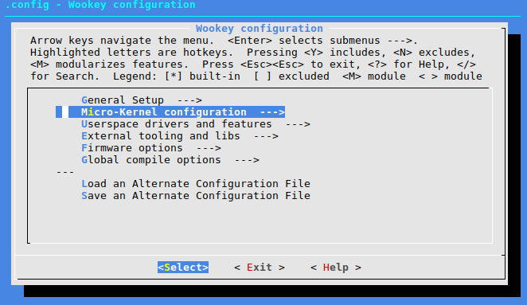
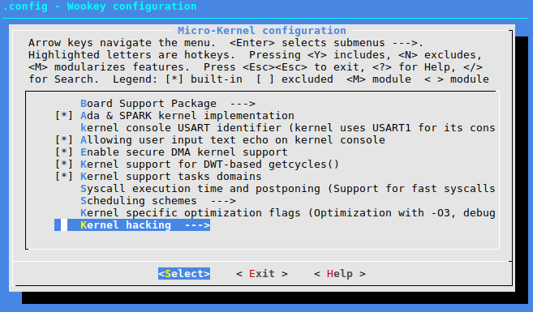
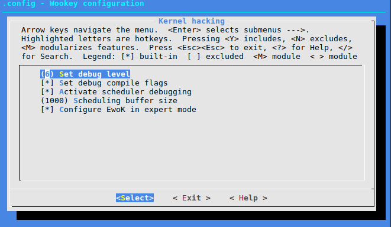

Debugging and logging with WooKey
=================================

.. contents::

Activating the debug
--------------------

Configuring for debugging
^^^^^^^^^^^^^^^^^^^^^^^^^

In the kernel hacking section of the menuconfig, it is possible to set the debug level of the kernel.

The debug level values are the following:

+-------------+----------------------------------------+
| Debug level | Definition                             |
+=============+========================================+
|   0         |  Emergency debug messages only         |
+-------------+----------------------------------------+
|   1         | Alert and higher debug messages        |
+-------------+----------------------------------------+
|   2         | Critical and higher debug messages     |
+-------------+----------------------------------------+
|   3         | Error and higher debug messages        |
+-------------+----------------------------------------+
|   4         | Warning and higher debug messages      |
+-------------+----------------------------------------+
|   5         | Notice and higher debug messages       |
+-------------+----------------------------------------+
|   6         | Informational and higher debug messages|
+-------------+----------------------------------------+
|   7         | Full debug                             |
+-------------+----------------------------------------+

Also set the debug compilation flags. It will add -ggdb to the compilation directives
and symbols will be added to the ELF binaries. There is no impact on the
target binary size, as Tataouine generates hex file and drops symbols from it.
Nevertheless, the usage of debug compilation flags will prove helpful
when using gdb (see below).

WooKey serial console
^^^^^^^^^^^^^^^^^^^^^

The kernel is outputting its console in the USART configured in the kernel menu
of the menuconfig. On the WooKey board, USART1 and USART4 can be used. On
Discovery boards USART1 (using GPIOB6 and GPIOB7 connected to the host PC USB
through a TTL to USB connector) can be used.

Beware that with informational debug, the kernel output might be huge
and generate big latencies. This may have an impact on the userspace drivers
behavior.

Flashing the new version
------------------------

Use either openocd or st-util to spawn a gdb server. The Makefile's rules 'run'
and 'debug' assume that openocd is running. Load the ELF from gdb to burn it into
the SoC's flash.

First start openocd::

    $ openocd -f tools/stm32f4disco0.cfg

.. note::
   You might use tools/stm32f4disco1.cfg instead of tools/stm32f4disco0.cfg dpeending on your exact
   revision of the F407 Discovery board.

It connects to the on-board ST-LinkV2, listening for a debug
connection  on local port 3333. You can then start arm-none-eabi-gdb and
connect it to openocd::
   
   $ arm-none-eabi-gdb -x tools/gdbinit
   (gdb) target extended-remote localhost:3333
   ...
   (gdb) info registers
   ...
   (gdb) monitor reset halt
   (gdb) continue

As you have a remote gdb access to the board, you have a complete
capacity to use breakpoints, watchpoints, and use various generated
ELF files to get back symbols.

Debugging userspace drivers and applications
--------------------------------------------

EwoK supports the standard printf() function and prints
the content on the kernel USART through a syscall (see :ref:`technical-docs`).

By default USART1 (configurable USART6 depending on the board) is used
as a kernel logging output.

.. hint::
   On the STM32 Discovery F407, the USART1 uses the PB6 pin as its output TX, and
   PB7 as the RX input.

A printf like format is used. Arguments can be:
   * a decimal value (%d for int and %lld for long long int)
   * a hexadecimal value (%x)
   * a string (%s)
   * a character (%c)

With gdb, you can load the ELF file of the userspace application
in order to easily manipulate its symbols::

   (gdb) symbol-file build/armv7-m/st32f407discovery/apps/myapp/myapp.elf
   (gdb) print myvar
   12
   (gdb) break myfunction
   (gdb) monitor reset halt
   (gdb) continue
   (gdb) Breakpoint 1: myfunction at main.c:28

